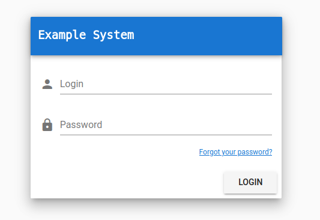
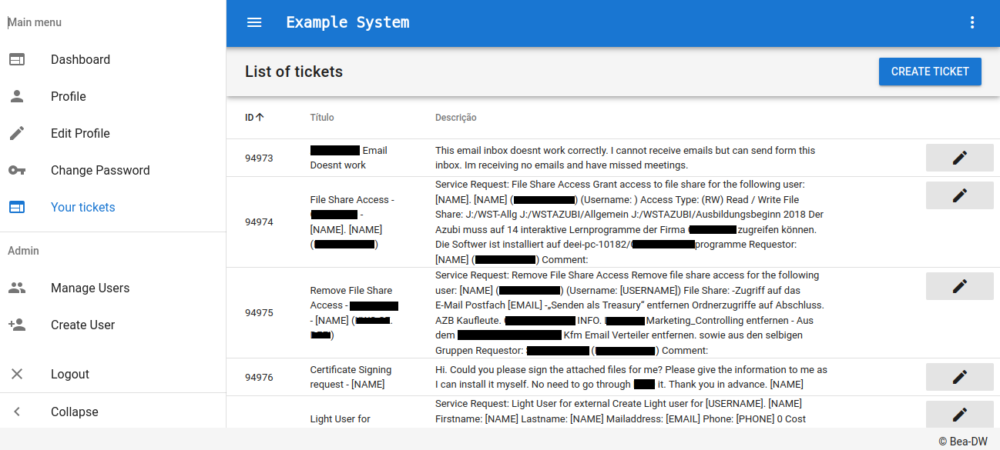
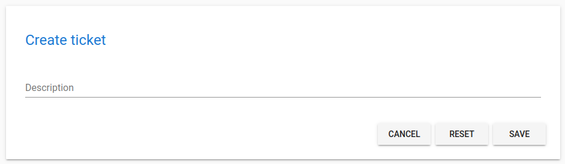
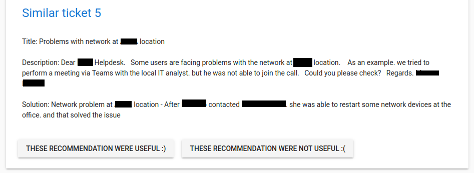

# open-capivara-interface-web
For the main repo, see [open-capivara](https://github.com/skaylink/open-capivara)

Login page:



Currently open alerts:



Creating new alert:



Retrieving similar alerts:



# Getting started
Project setup:
```
npm install
```

 Compiles and hot-reloads for development:
```
npm run serve
```

 Compiles and minifies for production:
```
npm run build
```

 Run your tests:
```
npm run test
```

 Lints and fixes files:
```
npm run lint
```

 Run your unit tests:
```
npm run test:unit
```
